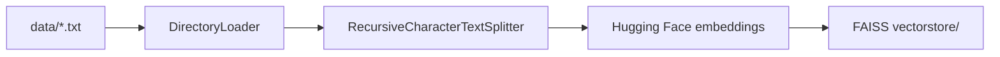
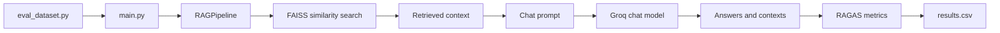

# RAG-Eval-Ragas

A minimal sample **Retrieval-Augmented Generation (RAG)** application, evaluated with **[RAGAS](https://github.com/explodinggradients/ragas)**.

The application ingests internal text documents into a local FAISS vector store,
retrieves relevant chunks for each question, generates grounded answers with a
Groq-hosted chat model, and evaluates those answers with RAGAS.

## 1. Project layout

```text
RAG-Eval-Ragas/
├── src/
│   └── rag_eval/
│       ├── ingest.py            # builds the FAISS vector store
│       ├── ragpipeline.py       # the RAG pipeline
│       ├── eval_dataset.py      # hand-written Q&A ground truth
│       └── settings.py          # shared environment-backed settings
├── main.py                     # main RAGAS evaluation entry point
├── data/                       # source documents
├── vectorstore/                # generated FAISS index
├── pyproject.toml              # package configuration
├── requirements.txt
└── README.md
```

## 2. Technology stack

- **Python**: application runtime
- **LangChain**: document loading, text splitting, embeddings, vector search, and model orchestration
- **Hugging Face Sentence Transformers**: local document and query embeddings
- **FAISS**: local vector index for similarity search
- **Groq**: chat model provider for answer generation and RAGAS evaluation
- **RAGAS**: faithfulness, answer relevance, context precision, and context recall metrics
- **Hugging Face Datasets**: evaluation dataset representation
- **Pandas**: CSV result export
- **python-dotenv**: `.env` configuration loading

## 3. Data flow

### Indexing flow



Run `python -m rag_eval.ingest` after changing documents or the embedding model.

### Evaluation flow



## 4. Setup (Windows)

Open PowerShell or Command Prompt in `C:\Users\hp\AI\RAG-Eval-Ragas` and run:

```powershell
python -m venv venv
venv\Scripts\activate
pip install -r requirements.txt
pip install -e .
```

Create a `.env` file in the project root with the provider credentials and model settings:

```powershell
notepad .env
```

```dotenv
GROQ_API_KEY=your-groq-api-key
HF_TOKEN=your-hugging-face-token
EMBEDDING_MODEL=sentence-transformers/all-MiniLM-L6-v2
CHAT_MODEL=openai/gpt-oss-20b
```

Keep `.env` private. The settings module loads these values for ingestion,
retrieval, generation, and evaluation.

## 5. Build the vector store

This reads the two sample docs in `data/`, chunks them, embeds them, and saves a local FAISS index to `vectorstore/`:

```powershell
python -m rag_eval.ingest
```

## 6. Try the RAG pipeline interactively

```powershell
python -m rag_eval.ragpipeline
```

Example questions to try (based on the sample docs):
- "How many vacation days do employees get?"
- "What is the price of the Growth plan?"
- "What security certifications does the platform have?"

## 7. Run the RAGAS evaluation

```powershell
python main.py
```

This will:
1. Run each question in `src/rag_eval/eval_dataset.py` through the RAG pipeline.
2. Score the results using four core RAGAS metrics:
   - **faithfulness** — is the generated answer actually supported by the retrieved context (i.e. no hallucination)?
   - **answer_relevancy** — does the answer actually address the question asked?
   - **context_precision** — of the chunks retrieved, how many are relevant to the question?
   - **context_recall** — did retrieval surface the information needed to match the ground-truth answer?
3. Print a per-question and overall summary, and save full results to `results.csv`.

## 8. Extending this sample

- **Swap in your own documents**: drop more `.txt` files into `data/` and re-run `python -m rag_eval.ingest`.
- **Add more eval questions**: extend the list in `src/rag_eval/eval_dataset.py` with more `question` / `ground_truth` pairs.
- **Add more RAGAS metrics**: RAGAS also supports `context_relevancy`, `answer_similarity`, `answer_correctness`, and others — import them from `ragas.metrics` and add to the `metrics=[...]` list in `main.py`.
- **Swap the vector store**: replace FAISS with Chroma, Pinecone, or Weaviate by changing the imports in `src/rag_eval/ingest.py` and `src/rag_eval/ragpipeline.py`.
- **Swap the LLM**: change `CHAT_MODEL` / `EMBEDDING_MODEL` in `.env`, or replace `ChatGroq` with another LangChain-supported chat model.

## Notes

- Running `main.py` makes real Groq API calls for answer generation and RAGAS metric scoring. Embeddings are generated locally by Hugging Face unless the configured embedding implementation requires remote access.
- The package versions listed in `requirements.txt` are known to work together as of this writing; feel free to update them, but re-test if you do.
